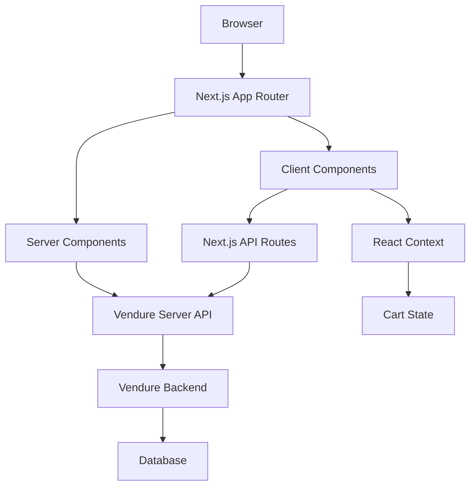
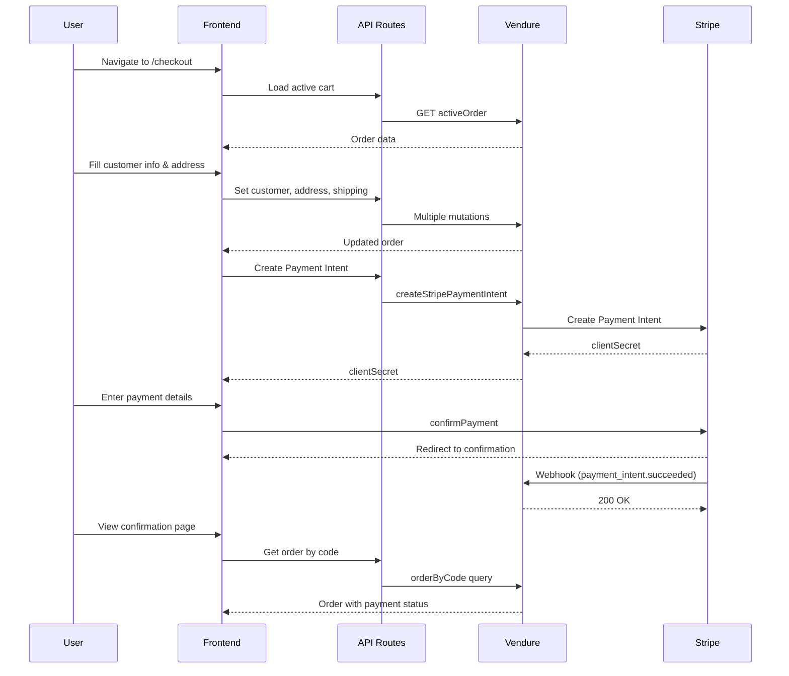

# 🏠 Florida Home Furniture - Quality Furniture E-commerce

[](https://nextjs.org/)
[](https://www.typescriptlang.org/)
[](https://tailwindcss.com/)
[](https://vendure.io/)

> **Quality furniture for every home** - A modern, high-performance e-commerce platform for affordable, quality furniture built with Next.js 14 and Vendure.

## 📋 Table of Contents

- [🚀 Features](#-features)
- [🛠️ Tech Stack](#️-tech-stack)
- [📁 Project Structure](#-project-structure)
- [⚡ Quick Start](#-quick-start)
- [🔧 Configuration](#-configuration)
- [🏗️ Architecture](#️-architecture)
- [📦 Components](#-components)
- [🛒 Shopping Cart System](#-shopping-cart-system)
- [🎨 Styling & Animations](#-styling--animations)
- [🔌 Vendure Integration](#-vendure-integration)
- [📱 API Routes](#-api-routes)
- [🧪 Development](#-development)
- [🚀 Deployment](#-deployment)
- [📚 Documentation](#-documentation)
- [🤝 Contributing](#-contributing)
- [📄 License](#-license)

## 🚀 Features

### ✨ Core Features
- **🛍️ Full E-commerce Functionality** - Complete shopping cart, product catalog, and checkout flow
- **🎨 Modern UI/UX** - Clean, responsive design with smooth animations
- **⚡ High Performance** - Server-side rendering, static generation, and optimized images
- **🔍 Advanced Search** - Real-time product search with filtering and sorting
- **📱 Mobile-First** - Fully responsive design optimized for all devices
- **♿ Accessibility** - WCAG compliant with proper ARIA labels and keyboard navigation
- **💰 Affordable Pricing** - Quality furniture at accessible prices for every budget

### 🛒 Shopping Experience
- **🛒 Smart Cart System** - Persistent cart with optimistic updates
- **💳 Multiple Payment Methods** - Stripe, PayPal, and custom payment integrations
- **📦 Inventory Management** - Real-time stock levels and availability
- **🏷️ Product Variants** - Size, color, and material options
- **⭐ Reviews & Ratings** - Customer testimonials and product reviews
- **🎁 Wishlist** - Save favorite products for later
- **🚚 Free Shipping** - Free delivery on orders over $200

### 🎯 Business Features
- **📊 Analytics Integration** - Google Analytics and custom tracking
- **🌍 Multi-language Support** - i18n ready with language switching
- **💱 Multi-currency** - Dynamic currency conversion
- **📧 Email Notifications** - Order confirmations and updates
- **🔐 User Authentication** - Secure login and registration
- **👤 Customer Profiles** - Order history and preferences

## 🛠️ Tech Stack

### Frontend
- **[Next.js 14](https://nextjs.org/)** - React framework with App Router
- **[TypeScript](https://www.typescriptlang.org/)** - Type-safe JavaScript
- **[Tailwind CSS](https://tailwindcss.com/)** - Utility-first CSS framework
- **[shadcn/ui](https://ui.shadcn.com/)** - Beautiful, accessible component library
- **[Framer Motion](https://www.framer.com/motion/)** - Production-ready motion library
- **[Lucide React](https://lucide.dev/)** - Beautiful & consistent icon toolkit

### Backend & APIs
- **[Vendure](https://vendure.io/)** - Headless e-commerce platform
- **[GraphQL](https://graphql.org/)** - Query language for APIs
- **[GraphQL Request](https://github.com/jasonkuhrt/graphql-request)** - Minimal GraphQL client

### Development Tools
- **[ESLint](https://eslint.org/)** - Code linting and formatting
- **[PostCSS](https://postcss.org/)** - CSS transformation tool
- **[Autoprefixer](https://github.com/postcss/autoprefixer)** - CSS vendor prefixing

## 📁 Project Structure

```
florida_home_front/
├── 📁 .next/                   # Next.js build output (auto-generated)
├── 📁 app/                     # Next.js App Router
│   ├── 📁 api/                 # API Routes
│   │   └── 📁 cart/            # Cart API endpoints
│   │       ├── active/route.ts # Get active cart
│   │       ├── add/route.ts    # Add item to cart
│   │       ├── clear/route.ts  # Clear cart
│   │       ├── remove/route.ts # Remove item from cart
│   │       └── update/route.ts # Update item quantity
│   ├── 📁 cart/                # Cart page
│   │   └── page.tsx            # Cart page component
│   ├── 📁 products/            # Products page
│   │   └── page.tsx            # Products listing page
│   ├── globals.css             # Global styles
│   ├── layout.tsx              # Root layout component
│   └── page.tsx                # Homepage
├── 📁 components/              # React components
│   ├── 📁 cart/                # Cart-related components
│   │   ├── add-to-cart-button.tsx
│   │   ├── cart-item.tsx
│   │   ├── cart-page.tsx
│   │   └── mini-cart.tsx
│   ├── 📁 ui/                  # shadcn/ui components
│   │   ├── button.tsx
│   │   ├── card.tsx
│   │   ├── input.tsx
│   │   └── ... (40+ components)
│   ├── about-quote.tsx
│   ├── banner.tsx
│   ├── collections-bento.tsx
│   ├── cta-section.tsx
│   ├── enhanced-products-grid.tsx
│   ├── footer.tsx
│   ├── header.tsx
│   ├── hero-new.tsx
│   ├── hero.tsx
│   ├── premium-collection.tsx
│   ├── products-section.tsx
│   ├── promotional-banner.tsx
│   ├── stats.tsx
│   ├── testimonials-section.tsx
│   └── trust-section.tsx
├── 📁 contexts/                # React Context providers
│   └── cart-context.tsx        # Global cart state management
├── 📁 hooks/                   # Custom React hooks
│   ├── use-counter-animation.ts
│   ├── use-scroll-animation.ts
│   └── use-toast.ts
├── 📁 lib/                     # Utility libraries
│   ├── 📁 graphql/             # GraphQL queries and mutations
│   │   ├── fragments.ts        # GraphQL fragments
│   │   ├── mutations.ts        # GraphQL mutations
│   │   └── queries.ts          # GraphQL queries
│   ├── animations.ts           # Framer Motion animations
│   ├── data.ts                 # Static data and constants
│   ├── types.ts                # TypeScript type definitions
│   ├── utils.ts                # Utility functions
│   ├── vendure-client.ts       # Client-side Vendure integration
│   └── vendure-server.ts       # Server-side Vendure integration
├── 📁 node_modules/            # Dependencies (auto-generated)
├── .eslintrc.json              # ESLint configuration
├── .gitignore                  # Git ignore rules
├── components.json             # shadcn/ui configuration
├── env.example                 # Environment variables template
├── middleware.ts               # Next.js middleware
├── next-env.d.ts               # Next.js TypeScript definitions
├── next.config.js              # Next.js configuration
├── package-lock.json           # Dependency lock file
├── package.json                # Project dependencies and scripts
├── postcss.config.js           # PostCSS configuration
├── README.md                   # This file
├── tailwind.config.ts          # Tailwind CSS configuration
├── tsconfig.json               # TypeScript configuration
└── VENDURE_INTEGRATION.md      # Vendure integration documentation
```

## ⚡ Quick Start

### Prerequisites
- **Node.js** 18.17 or later
- **npm** 9.0 or later
- **Vendure** backend running (see [Vendure Setup](#vendure-setup))

### Installation

1. **Clone the repository**
   ```bash
   git clone https://github.com/your-username/florida_home_front.git
   cd florida_home_front
   ```

2. **Install dependencies**
   ```bash
   npm install
   ```

3. **Set up environment variables**
   ```bash
   cp env.example .env.local
   ```
   
   Edit `.env.local` with your configuration:
   ```env
   # Vendure Configuration
   VENDURE_SHOP_API_URL=http://localhost:3000/shop-api
   VENDURE_ADMIN_API_URL=http://localhost:3000/admin-api
   
   # Next.js Configuration
   NEXT_PUBLIC_VENDURE_API_URL=http://localhost:3000/shop-api
   NEXT_PUBLIC_SITE_URL=http://localhost:3001
   
   # Stripe Configuration
   NEXT_PUBLIC_STRIPE_PUBLISHABLE_KEY=pk_test_your_key_here
   STRIPE_SECRET_KEY=sk_test_your_key_here
   ```

4. **Start the development server**
   ```bash
   npm run dev
   ```

5. **Open your browser**
   Navigate to [http://localhost:3000](http://localhost:3000)

### Vendure Setup

1. **Install Vendure CLI**
   ```bash
   npm install -g @vendure/cli
   ```

2. **Create a new Vendure project**
   ```bash
   vendure create my-vendure-shop
   cd my-vendure-shop
   ```

3. **Start Vendure**
   ```bash
   npm run dev
   ```

4. **Access Vendure Admin**
   Navigate to [http://localhost:3000/admin](http://localhost:8080/admin)

## 🔧 Configuration

### Environment Variables

| Variable | Description | Default |
|----------|-------------|---------|
| `VENDURE_SHOP_API_URL` | Vendure Shop API endpoint | `http://localhost:8080/shop-api` |
| `VENDURE_ADMIN_API_URL` | Vendure Admin API endpoint | `http://localhost:8080/admin-api` |
| `NEXT_PUBLIC_VENDURE_API_URL` | Public Vendure API URL | `http://localhost:8080/shop-api` |
| `NEXT_PUBLIC_SITE_URL` | Public site URL | `http://localhost:3001` |
| `NEXT_PUBLIC_STRIPE_PUBLISHABLE_KEY` | Stripe publishable key | `pk_test_...` |
| `STRIPE_SECRET_KEY` | Stripe secret key (server-side only) | `sk_test_...` |

### Next.js Configuration

The project uses Next.js 14 with the following optimizations:

```javascript
// next.config.js
const nextConfig = {
  eslint: {
    ignoreDuringBuilds: true,
  },
  images: {
    unoptimized: true,
    remotePatterns: [
      {
        protocol: 'https',
        hostname: 'images.pexels.com',
      },
    ],
  },
};
```

### Tailwind Configuration

Custom Tailwind configuration with:
- **Custom color palette** - Orange and amber theme
- **Extended spacing** - Custom spacing scale
- **Animation utilities** - Custom animations
- **Component classes** - Reusable component styles

## 🏗️ Architecture

### Server Components vs Client Components

The project follows Next.js 14 best practices:

#### Server Components (Default)
- **Used for**: Static content, data fetching, SEO-critical pages
- **Examples**: Product pages, collection pages, homepage sections
- **Benefits**: Better performance, SEO, and caching

```tsx
// app/product/page.tsx - Server Component
import { getAllProducts } from '@/lib/vendure-server';

export default async function ProductsPage() {
  const result = await getAllProducts(60);
  const products = result.data?.products?.items || [];
  
  return (
    <div>
      {products.map(product => (
        <ProductCard key={product.id} product={product} />
      ))}
    </div>
  );
}
```

#### Client Components
- **Used for**: Interactive features, state management, browser APIs
- **Examples**: Cart functionality, search, animations
- **Benefits**: Rich interactivity, real-time updates

```tsx
// components/cart/mini-cart.tsx - Client Component
'use client';

import { useState } from 'react';
import { useCart } from '@/contexts/cart-context';

export function MiniCart() {
  const [isOpen, setIsOpen] = useState(false);
  const { items, itemCount } = useCart();
  
  return (
    // Interactive cart dropdown
  );
}
```

### Data Flow Architecture



## 📦 Components

### Core Components

#### Header (`components/header.tsx`)
- **Purpose**: Main navigation and site header
- **Features**: Logo, navigation menu, search, cart, user account
- **Responsive**: Mobile hamburger menu, desktop navigation

#### Hero Section (`components/hero-new.tsx`)
- **Purpose**: Eye-catching homepage hero with call-to-action
- **Features**: Animated text, background images, statistics, scroll indicators
- **Animations**: Framer Motion with staggered animations

#### Enhanced Products Grid (`components/enhanced-products-grid.tsx`)
- **Purpose**: Product catalog with search and filtering
- **Features**: Real-time search, sorting, pagination, product cards
- **Integration**: Vendure API for product data

#### Premium Collection (`components/premium-collection.tsx`)
- **Purpose**: Showcase featured products
- **Features**: Grid layout, hover effects, product links
- **Design**: Masonry-style layout with different sizes

### Cart Components

#### Cart Context (`contexts/cart-context.tsx`)
- **Purpose**: Global cart state management
- **Features**: Add/remove items, quantity updates, persistent state
- **API Integration**: Vendure cart mutations

#### Mini Cart (`components/cart/mini-cart.tsx`)
- **Purpose**: Quick cart preview in header
- **Features**: Dropdown, item count badge, quick actions
- **UX**: Smooth animations, loading states

#### Cart Page (`components/cart/cart-page.tsx`)
- **Purpose**: Full cart management page
- **Features**: Item list, quantity controls, order summary
- **Layout**: Two-column layout with sticky summary

### UI Components (shadcn/ui)

The project includes 40+ pre-built components from shadcn/ui:

- **Form Components**: Button, Input, Select, Checkbox, Radio
- **Layout Components**: Card, Container, Separator, Grid
- **Navigation Components**: Navigation Menu, Breadcrumb, Pagination
- **Feedback Components**: Alert, Toast, Progress, Skeleton
- **Overlay Components**: Dialog, Sheet, Popover, Tooltip
- **Data Display**: Table, Badge, Avatar, Aspect Ratio

## 🛒 Shopping Cart System

### Cart State Management

The cart system uses React Context for global state management:

```tsx
// contexts/cart-context.tsx
interface CartContextType {
  items: OrderLine[];           // Cart items
  itemCount: number;            // Total item count
  total: number;                // Total price
  addItem: (id, quantity) => Promise<void>;
  removeItem: (orderLineId) => Promise<void>;
  updateQuantity: (id, qty) => Promise<void>;
  clearCart: () => Promise<void>;
  isLoading: boolean;           // Loading state
  isUpdating: boolean;          // Update state
  error: string | null;         // Error state
  order: Order | null;          // Complete order
  refreshCart: () => Promise<void>;
}
```

### Cart Operations

#### Adding Items
```tsx
const { addItem } = useCart();

await addItem(productVariantId, quantity);
```

#### Updating Quantities
```tsx
const { updateQuantity } = useCart();

await updateQuantity(orderLineId, newQuantity);
```

#### Removing Items
```tsx
const { removeItem } = useCart();

await removeItem(orderLineId);
```

### Cart Persistence

- **Server-side**: Cart data stored in Vendure database
- **Client-side**: Cart state managed by React Context
- **Session**: Cart persists across browser sessions
- **Optimistic Updates**: UI updates immediately, syncs with server

## 💳 Checkout & Payment System (Stripe Integration)

### Overview

The checkout system implements a complete end-to-end payment flow using **Vendure** as the backend and **Stripe** as the payment gateway. The integration uses Stripe's **Payment Intents API** with the **Payment Element** for a secure, PCI-compliant checkout experience.

### Architecture



### Checkout Flow Steps

#### Step 1: Customer Information (`/checkout?step=customer`)

Users provide:
- **Contact Information**: First name, last name, email
- **Shipping Address**: Full name, street address, city, state, postal code, phone
- **Billing Address**: Optional separate billing address
- **Shipping Method**: Select from eligible shipping methods provided by Vendure

**API Calls:**
```typescript
// Set customer for order
POST /api/checkout/set-customer
Body: { firstName, lastName, emailAddress }

// Set shipping address
POST /api/checkout/set-shipping-address
Body: { fullName, streetLine1, streetLine2, city, province, postalCode, countryCode, phoneNumber }

// Set billing address (if different)
POST /api/checkout/set-billing-address
Body: { fullName, streetLine1, streetLine2, city, province, postalCode, countryCode, phoneNumber }

// Set shipping method
POST /api/checkout/set-shipping-method
Body: { shippingMethodId }

// Get eligible shipping methods
GET /api/checkout/shipping-methods
Response: { shippingMethods: [...] }
```

#### Step 2: Payment (`/checkout?step=payment`)

The payment step uses Stripe's **Payment Element** for secure payment collection:

**Features:**
- Pre-built, customizable payment form
- Supports multiple payment methods (cards, wallets, local payment methods)
- Automatic SCA/3DS handling
- Built-in validation and error handling
- Mobile-optimized UI

**Implementation:**
```typescript
// Create Payment Intent
POST /api/checkout/payment-intent
Body: { orderCode }
Response: { clientSecret }

// Payment Element initialization
<Elements options={{ clientSecret }} stripe={stripePromise}>
  <PaymentElement />
</Elements>

// Confirm payment
stripe.confirmPayment({
  elements,
  confirmParams: {
    return_url: `${SITE_URL}/checkout/confirmation/${orderCode}`
  }
})
```

#### Step 3: Confirmation (`/checkout/confirmation/[orderCode]`)

After Stripe processes the payment, users are redirected to the confirmation page:

**URL Parameters:**
- `payment_intent`: Stripe Payment Intent ID
- `payment_intent_client_secret`: Client secret for verification
- `redirect_status`: Payment result (`succeeded`, `processing`, or `requires_payment_method`)

**Order States:**
- ✅ **Success**: Payment succeeded, order confirmed
- ⏳ **Pending**: Payment processing (async payment methods)
- ❌ **Failed**: Payment declined or error

### API Routes

#### Checkout API Endpoints

```typescript
// Get order by code
GET /api/orders/[orderCode]
Response: { order: Order }

// Set customer information
POST /api/checkout/set-customer
Body: { firstName, lastName, emailAddress }
Response: { order: Order }

// Set shipping address
POST /api/checkout/set-shipping-address
Body: { fullName, streetLine1, streetLine2, city, province, postalCode, countryCode, phoneNumber }
Response: { order: Order }

// Set billing address
POST /api/checkout/set-billing-address
Body: { fullName, streetLine1, streetLine2, city, province, postalCode, countryCode, phoneNumber }
Response: { order: Order }

// Set shipping method
POST /api/checkout/set-shipping-method
Body: { shippingMethodId }
Response: { order: Order }

// Get eligible shipping methods
GET /api/checkout/shipping-methods
Response: { shippingMethods: ShippingMethod[] }

// Create Stripe Payment Intent
POST /api/checkout/payment-intent
Body: { orderCode }
Response: { clientSecret: string }
```

### GraphQL Mutations

```graphql
# Set customer for order
mutation SetCustomerForOrder($input: CreateCustomerInput!) {
  setCustomerForOrder(input: $input) {
    ... on Order { ...Order }
    ... on ErrorResult { errorCode message }
  }
}

# Set shipping address
mutation SetOrderShippingAddress($input: CreateAddressInput!) {
  setOrderShippingAddress(input: $input) {
    ... on Order { ...Order }
    ... on ErrorResult { errorCode message }
  }
}

# Set billing address
mutation SetOrderBillingAddress($input: CreateAddressInput!) {
  setOrderBillingAddress(input: $input) {
    ... on Order { ...Order }
    ... on ErrorResult { errorCode message }
  }
}

# Set shipping method
mutation SetOrderShippingMethod($shippingMethodId: [ID!]!) {
  setOrderShippingMethod(shippingMethodId: $shippingMethodId) {
    ... on Order { ...Order }
    ... on ErrorResult { errorCode message }
  }
}

# Create Stripe Payment Intent
mutation CreateStripePaymentIntent($orderCode: String!) {
  createStripePaymentIntent(orderCode: $orderCode)
}
```

### GraphQL Queries

```graphql
# Get order by code
query GetOrderByCode($code: String!) {
  orderByCode(code: $code) {
    ...Order
  }
}

# Get eligible shipping methods
query GetEligibleShippingMethods {
  eligibleShippingMethods {
    id
    code
    name
    description
    price
    priceWithTax
  }
}
```

### Stripe Configuration

#### Environment Variables

Add these to your `.env.local`:

```env
# Stripe Configuration
NEXT_PUBLIC_STRIPE_PUBLISHABLE_KEY=pk_test_...
STRIPE_SECRET_KEY=sk_test_...
```

#### Stripe Dashboard Setup

1. **Enable Payment Methods**: Configure which payment methods to accept
2. **Setup Webhooks**: Point to your Vendure webhook endpoint
3. **Test Mode**: Use test keys for development

#### Webhook Configuration

The Stripe webhook is handled by Vendure's **StripePlugin**:

**Webhook URL**: `https://your-vendure-backend.com/payments/stripe`

**Events to listen:**
- `payment_intent.succeeded` - Payment succeeded
- `payment_intent.payment_failed` - Payment failed
- `payment_intent.processing` - Payment processing (async methods)

**Local Development:**
```bash
# Install Stripe CLI
brew install stripe/stripe-cli/stripe

# Login to Stripe
stripe login

# Forward webhooks to local Vendure
stripe listen --forward-to http://localhost:3000/payments/stripe
```

### Vendure StripePlugin Setup

Ensure Vendure is configured with the StripePlugin:

```typescript
// vendure-config.ts
import { StripePlugin } from '@vendure/payments-plugin/package/stripe';

export const config: VendureConfig = {
  plugins: [
    StripePlugin.init({
      storeCustomersInStripe: true,
    }),
  ],
};
```

### Security Best Practices

1. **Never expose secret keys**: Only use `NEXT_PUBLIC_` prefix for publishable keys
2. **Server-side API routes**: All Vendure mutations happen server-side
3. **PCI Compliance**: Stripe Elements handles sensitive card data
4. **HTTPS required**: Stripe requires HTTPS for production
5. **Webhook signature verification**: Vendure automatically verifies webhook signatures

### Error Handling

The checkout flow includes comprehensive error handling:

**Validation Errors:**
- Form validation using Zod schema
- Real-time field validation
- Clear error messages

**Payment Errors:**
- Card declined
- Insufficient funds
- Invalid card details
- 3DS authentication failure

**Network Errors:**
- API timeout handling
- Retry mechanisms
- User-friendly error messages

### Testing

#### Test Cards (Stripe Test Mode)

```
# Successful payment
4242 4242 4242 4242

# 3DS authentication required
4000 0025 0000 3155

# Card declined
4000 0000 0000 9995

# Insufficient funds
4000 0000 0000 9995
```

#### Test Workflow

1. **Add products to cart**
2. **Navigate to checkout**
3. **Fill customer information**
4. **Select shipping method**
5. **Enter test card details**
6. **Complete payment**
7. **Verify confirmation page**

### Components

#### OrderSummary Component

Reusable component for displaying order information:

```tsx
// components/checkout/order-summary.tsx
interface OrderSummaryProps {
  order: Order;
  showItems?: boolean;
}

<OrderSummary order={order} showItems={true} />
```

**Features:**
- Order items with images
- Subtotal, shipping, and total
- Shipping method display
- Address information
- Responsive layout

### Performance Optimizations

1. **Lazy Loading**: Stripe.js loads only on payment step
2. **Server Components**: Most checkout UI is server-rendered
3. **Optimistic Updates**: UI updates immediately
4. **Minimal JavaScript**: Only interactive parts are client components
5. **Image Optimization**: Product images use Next.js Image component

### Accessibility

- **Keyboard Navigation**: Full keyboard support
- **Screen Readers**: Proper ARIA labels
- **Focus Management**: Logical focus order
- **Error Announcements**: Screen reader announcements for errors
- **High Contrast**: Meets WCAG AA standards

### Analytics & Conversion Tracking

Recommended events to track:

```typescript
// Begin checkout
gtag('event', 'begin_checkout', {
  currency: 'ARS',
  value: orderTotal,
  items: orderItems
});

// Add payment info
gtag('event', 'add_payment_info', {
  currency: 'ARS',
  value: orderTotal,
  payment_type: 'credit_card'
});

// Purchase
gtag('event', 'purchase', {
  transaction_id: orderCode,
  value: orderTotal,
  currency: 'ARS',
  tax: taxAmount,
  shipping: shippingCost,
  items: orderItems
});
```

## 🎨 Styling & Animations

### Tailwind CSS

The project uses Tailwind CSS with a custom configuration:

```typescript
// tailwind.config.ts
module.exports = {
  content: [
    './pages/**/*.{js,ts,jsx,tsx,mdx}',
    './components/**/*.{js,ts,jsx,tsx,mdx}',
    './app/**/*.{js,ts,jsx,tsx,mdx}',
  ],
  theme: {
    extend: {
      colors: {
        orange: {
          50: '#fff7ed',
          500: '#f97316',
          600: '#ea580c',
          700: '#c2410c',
        },
      },
      animation: {
        'fade-in-up': 'fadeInUp 0.6s ease-out',
        'slide-in-left': 'slideInLeft 0.6s ease-out',
      },
    },
  },
  plugins: [require('tailwindcss-animate')],
};
```

### Framer Motion Animations

Custom animation variants for consistent motion:

```typescript
// lib/animations.ts
export const fadeInUp: Variants = {
  hidden: { opacity: 0, y: 60 },
  visible: {
    opacity: 1,
    y: 0,
    transition: { duration: 0.6, ease: [0.22, 1, 0.36, 1] }
  }
};

export const staggerContainer: Variants = {
  hidden: { opacity: 0 },
  visible: {
    opacity: 1,
    transition: {
      staggerChildren: 0.1,
      delayChildren: 0.2
    }
  }
};
```

### Custom Hooks

#### Scroll Animation Hook
```typescript
// hooks/use-scroll-animation.ts
export function useScrollAnimation(options = {}) {
  const { threshold = 0.1, triggerOnce = true } = options;
  const ref = useRef<HTMLElement>(null);
  const [isVisible, setIsVisible] = useState(false);

  useEffect(() => {
    const observer = new IntersectionObserver(
      ([entry]) => {
        if (entry.isIntersecting) {
          setIsVisible(true);
          if (triggerOnce && ref.current) {
            observer.unobserve(ref.current);
          }
        }
      },
      { threshold }
    );

    if (ref.current) {
      observer.observe(ref.current);
    }

    return () => observer.disconnect();
  }, [threshold, triggerOnce]);

  return { ref, isVisible };
}
```

## 🔌 Vendure Integration

### Server-side Integration

Server components use the Vendure server client for optimal performance:

```typescript
// lib/vendure-server.ts
export async function getProducts(options?: {
  take?: number;
  skip?: number;
  sort?: { name?: string; price?: string };
  filter?: { facetValueIds?: string[] };
  revalidate?: number;
}) {
  const query = `
    query GetProducts($options: ProductListOptions) {
      products(options: $options) {
        totalItems
        items {
          id
          name
          slug
          description
          featuredAsset {
            id
            preview
            source
          }
          variants {
            id
            name
            sku
            price
            priceWithTax
            currencyCode
            stockLevel
          }
        }
      }
    }
  `;

  return fetchGraphQL(
    { query, variables: { options } },
    { revalidate: options?.revalidate || 60 }
  );
}
```

### Client-side Integration

Client components use the Vendure client for real-time updates:

```typescript
// lib/vendure-client.ts
import { GraphQLClient } from 'graphql-request';

const VENDURE_API_URL = process.env.NEXT_PUBLIC_VENDURE_API_URL || 'http://localhost:3000/shop-api';

export const vendureClient = new GraphQLClient(VENDURE_API_URL, {
  credentials: 'include',
});
```

### GraphQL Queries

Organized GraphQL operations:

```typescript
// lib/graphql/queries.ts
export const GET_PRODUCTS = gql`
  ${PRODUCT_FRAGMENT}
  query GetProducts($options: ProductListOptions) {
    products(options: $options) {
      items {
        ...Product
      }
      totalItems
    }
  }
`;

export const GET_ACTIVE_ORDER = gql`
  ${ORDER_FRAGMENT}
  query GetActiveOrder {
    activeOrder {
      ...Order
    }
  }
`;
```

## 📱 API Routes

### Cart API Endpoints

#### Get Active Cart
```typescript
// app/api/cart/active/route.ts
export async function GET(request: NextRequest) {
  const cookieHeader = request.headers.get('cookie') || '';
  
  const response = await fetch(VENDURE_SHOP_API, {
    method: 'POST',
    headers: {
      'Content-Type': 'application/json',
      'Cookie': cookieHeader,
    },
    body: JSON.stringify({
      query: GET_ACTIVE_ORDER,
      variables: {},
    }),
  });

  return NextResponse.json(await response.json());
}
```

#### Add Item to Cart
```typescript
// app/api/cart/add/route.ts
export async function POST(request: NextRequest) {
  const { productVariantId, quantity } = await request.json();
  
  const response = await fetch(VENDURE_SHOP_API, {
    method: 'POST',
    headers: {
      'Content-Type': 'application/json',
      'Cookie': request.headers.get('cookie') || '',
    },
    body: JSON.stringify({
      query: ADD_ITEM_TO_ORDER,
      variables: { productVariantId, quantity },
    }),
  });

  return NextResponse.json(await response.json());
}
```

### Middleware

Next.js middleware handles CORS and cookie forwarding:

```typescript
// middleware.ts
export function middleware(request: NextRequest) {
  const response = NextResponse.next();

  // Forward cookies to maintain session state
  const cookieHeader = request.headers.get('cookie');
  if (cookieHeader) {
    response.headers.set('cookie', cookieHeader);
  }

  // Add CORS headers for development
  if (process.env.NODE_ENV === 'development') {
    response.headers.set('Access-Control-Allow-Origin', '*');
    response.headers.set('Access-Control-Allow-Methods', 'GET, POST, PUT, DELETE, OPTIONS');
    response.headers.set('Access-Control-Allow-Headers', 'Content-Type, Authorization, Cookie');
  }

  return response;
}
```

## 🧪 Development

### Available Scripts

```bash
# Development
npm run dev          # Start development server
npm run build        # Build for production
npm run start        # Start production server
npm run lint         # Run ESLint
npm run typecheck    # Run TypeScript compiler

# Database (if using local Vendure)
npm run db:reset     # Reset database
npm run db:seed      # Seed database with sample data
```

### Development Workflow

1. **Feature Development**
   ```bash
   git checkout -b feature/new-feature
   npm run dev
   # Make changes
   npm run lint
   npm run typecheck
   git commit -m "feat: add new feature"
   ```

2. **Component Development**
   ```bash
   # Create new component
   touch components/new-component.tsx
   
   # Add to storybook (if configured)
   npm run storybook
   ```

3. **API Development**
   ```bash
   # Create new API route
   mkdir -p app/api/new-endpoint
   touch app/api/new-endpoint/route.ts
   ```

### Code Quality

- **ESLint**: Configured with Next.js recommended rules
- **TypeScript**: Strict mode enabled with comprehensive type checking
- **Prettier**: Code formatting (if configured)
- **Husky**: Git hooks for pre-commit checks (if configured)

### Testing

```bash
# Unit tests (if configured)
npm run test

# E2E tests (if configured)
npm run test:e2e

# Coverage report
npm run test:coverage
```

## 🚀 Deployment

### Vercel (Recommended)

1. **Connect to Vercel**
   ```bash
   npm install -g vercel
   vercel login
   vercel
   ```

2. **Configure Environment Variables**
   - Add all environment variables in Vercel dashboard
   - Set production URLs for Vendure backend

3. **Deploy**
   ```bash
   vercel --prod
   ```

### Docker

```dockerfile
# Dockerfile
FROM node:18-alpine AS deps
WORKDIR /app
COPY package*.json ./
RUN npm ci --only=production

FROM node:18-alpine AS builder
WORKDIR /app
COPY . .
COPY --from=deps /app/node_modules ./node_modules
RUN npm run build

FROM node:18-alpine AS runner
WORKDIR /app
ENV NODE_ENV production
COPY --from=builder /app/public ./public
COPY --from=builder /app/.next/standalone ./
COPY --from=builder /app/.next/static ./.next/static

EXPOSE 3000
CMD ["node", "server.js"]
```

### Environment Variables for Production

```env
# Production Environment
VENDURE_SHOP_API_URL=https://your-vendure-backend.com/shop-api
VENDURE_ADMIN_API_URL=https://your-vendure-backend.com/admin-api
NEXT_PUBLIC_VENDURE_API_URL=https://your-vendure-backend.com/shop-api
NEXT_PUBLIC_SITE_URL=https://your-domain.com
```

## 📚 Documentation

### Additional Resources

- **[Vendure Integration Guide](./VENDURE_INTEGRATION.md)** - Detailed Vendure setup and integration
- **[Component Documentation](./docs/components.md)** - Component API and usage examples
- **[API Documentation](./docs/api.md)** - API endpoints and GraphQL schema
- **[Deployment Guide](./docs/deployment.md)** - Production deployment instructions

### External Documentation

- [Next.js Documentation](https://nextjs.org/docs)
- [Vendure Documentation](https://docs.vendure.io/)
- [Tailwind CSS Documentation](https://tailwindcss.com/docs)
- [shadcn/ui Documentation](https://ui.shadcn.com/)
- [Framer Motion Documentation](https://www.framer.com/motion/)

## 🤝 Contributing

We welcome contributions! Please follow these guidelines:

### Getting Started

1. **Fork the repository**
2. **Create a feature branch**
   ```bash
   git checkout -b feature/amazing-feature
   ```
3. **Make your changes**
4. **Run tests and linting**
   ```bash
   npm run lint
   npm run typecheck
   ```
5. **Commit your changes**
   ```bash
   git commit -m "feat: add amazing feature"
   ```
6. **Push to your branch**
   ```bash
   git push origin feature/amazing-feature
   ```
7. **Open a Pull Request**

### Code Style

- Use TypeScript for all new code
- Follow the existing code style and patterns
- Add proper type definitions
- Include JSDoc comments for complex functions
- Write meaningful commit messages

### Pull Request Guidelines

- Provide a clear description of changes
- Include screenshots for UI changes
- Ensure all tests pass
- Update documentation if needed
- Keep PRs focused and atomic

## 📄 License

This project is licensed under the MIT License - see the [LICENSE](LICENSE) file for details.

## 🙏 Acknowledgments

- **[Vendure](https://vendure.io/)** - Amazing headless e-commerce platform
- **[Next.js](https://nextjs.org/)** - The React framework for production
- **[shadcn/ui](https://ui.shadcn.com/)** - Beautiful, accessible components
- **[Tailwind CSS](https://tailwindcss.com/)** - Utility-first CSS framework
- **[Framer Motion](https://www.framer.com/motion/)** - Production-ready motion library

---

<div align="center">
  <p>Made with ❤️ by the Florida Home Furniture Team</p>
  <p>
    <a href="https://github.com/your-username/florida_home_front">GitHub</a> •
    <a href="https://your-domain.com">Live Demo</a> •
    <a href="https://docs.your-domain.com">Documentation</a>
  </p>
</div>